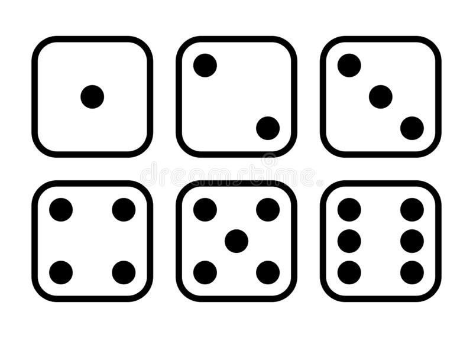

# Implementare aplicatii la nivel de FPGA

## Descrierea proiectului

Construiti un circuit care sa simuleze aruncarea a 2 zaruri. Atat timp cat un buton va fi tinut apasat 2 numaratoare vor numara (avand urmatoarea secventa: 1, 2, 3, 4, 5, 6 - primul dintre ele si 1, 3, 5, 2, 4, 6 - cel de-al doilea) la frecvente diferite (35 Hz si 47 Hz).

Cand butonul nu va fi apasat secventa de numarare "ingheata". 

Afisarea se face pe 7 LED-uri pentru fiecare numarator. Cele 7 LED-uri vor reprezenta punctele existente pe un zar si vor oferi posibilitatea afisarii unei informatii similare.

## Tehnologii si suport hardware folosit pentru implementare

- Basys3 FPGA Board
- mediul Vivado
- limbajul hardware VHDL

## Planificarea task-urilor

1. Divizor de frecventa
Pentru ca frecventa clock-ului FPGA-ului folosit este de 100MHz iar frecventa necesara numararii este de 35Hz, respectiv 47Hz, folosim doua divizoare de frecventa pentru fiecare numarator.

        Scale = freq_in/freq_out

        nr1 = 100MHz/35Hz = 2857142

        nr2 = 100MHz/47Hz = 2127660

2. Numaratorul 1 -> secventa 1, 2, 3, 4, 5, 6
- cand este apasat butonul de reset numaratorul ia valoarea 1
- in rest numara in mod obisnuit, incrementand valoarea cu 1
- cand ajunge la valoarea 6, revine la 1

3. Numaratorul 2 -> secventa 1, 3, 5, 2, 4, 6
- cand este apasat butonul de reset numaratorul ia valoarea 1
- numara incrementand valoarea cu 2
- cand ajunge la valoarea 5, numaratorul ia valoarea 2
- cand ajunge la 6, ia valoarea 1

4. LED-urile

5. Result

